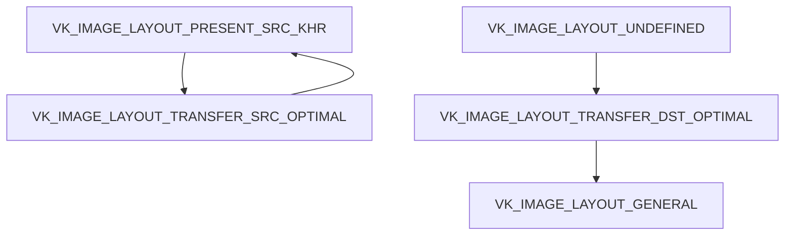

如何将vulkan中绘制的结果导出，并且存储为文件格式？

## OpenGL中将绘制结果存储为图片的方法
GPU渲染的结果保存在显存(帧缓存)中，想要将保存在显存中的结果转存到内存，在opengl中需要用到glReadPixels这个函数。
**glReadPixels：** 把已经绘制好的像素（它可能已经被保存到显卡的显存中）读取到内存。

``` haskell
			 void glReadPixels（GLint x, 
								GLint y,       	   → 左下角坐标
								GLsizei width,
                      			GLsizei height,    → 前四个参数描述了一个矩形范围
                                GLenum format,     → 像素存储的格式
                                GLenum type,   	   → 像素数据的数据类型
                                GLvoid * data）;   →返回像素数据
```

**实现过程：** 
step 1：申请一块放置读取到像素的内存
``` javascript
	RGBColor* ColorBuffer = new RGBColor[WindowSizeX * WindowSizeY];
```
step 2：从显存中读取像素
``` scss
	glReadPixels(0, 0, WindowSizeX, WindowSizeY, GL_BGR, GL_UNSIGNED_BYTE, ColorBuffer);
```
step 3：将数据写入目标图片文件

``` reasonml
	WriteBMP("output.bmp", ColorBuffer, WindowSizeX, WindowSizeY);
```

step 4：清理申请的内存

``` gradle
	delete[] ColorBuffer;
```

**注：** 这个存储的过程要放在OpenGL绘制结束后，在交换缓冲之前进行。

**参考链接** 
[双缓冲区模式下读取](https://blog.csdn.net/cd_yourheart/article/details/123528957)
[将OpenGL渲染的结果保存为图片](https://blog.csdn.net/u013412391/article/details/120565095)

## Vulkan中将绘制结果存储为图片的方法
**VS opengl：** 基本过程一致，GPU中保存绘制结果的地方→分配得到的内存。但是，opengl中提供了glReadPixels函数，只需要调用这个函数就可以将绘制结果读取出来，但是vulkan中并没有提供直接的函数。
 

**基本思路：** vulkan中渲染结果放在swapchain image中，程序中往往设定当前swapchain image的数量为物理设备支持的最小swapchain image数量+1,所以要在渲染完之后提交之前，将当前 Swap Chain Image 的内容先存在一块申请的显存上，之后内存映射到内存中。

1. Format问题
    当前物理设备支持的swapchain image的格式为：VK_FORMAT_B8G8R8A8_SRGB
	目标存储格式：VK_FORMAT_R8G8B8A8_SRGB
2.Layout问题
	当前swap chain Image的布局：VK_IMAGE_LAYOUT_PRESENT_SRC_KHR
	作为transfer source的布局：VK_IMAGE_LAYOUT_TRANSFER_SRC_OPTIMAL
	保存结果的图片初始的布局：VK_IMAGE_LAYOUT_UNDEFINED
	作为transfer destination的布局：VK_IMAGE_LAYOUT_TRANSFER_DST_OPTIMAL
3.swap chain image和output image之间布局的转换


	
**参考链接：**
[截屏原理](https://gavinkg.github.io/ILearnVulkanFromScratch-CN/mdroot/Vulkan%20%E8%BF%9B%E9%98%B6/%E6%88%AA%E5%8F%96%E5%B1%8F%E5%B9%95/%E5%8E%9F%E7%90%86.html)
[代码参考](https://github.com/SaschaWillems/VulkanCapsViewer/blob/master/vulkancapsviewer.cpp)
